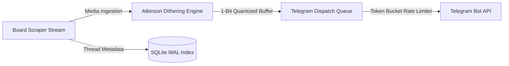
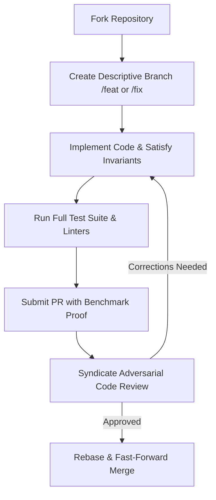

# 🛠️ Contributing to marko1olo/dvachbot

> **Engineering Mandate, Architectural Invariants & Contribution Standard**  
> Maintained by the **Жирняк & Адольф Петушков** Engineering Syndicate  
> Technology Foundation: `Python 3.11 / aiohttp / Pillow / SQLite WAL / Telegram Bot API`

---

## 📑 Table of Contents
1. [🏛️ Architectural Overview & Data Flow](#️-1-architectural-overview--data-flow)
2. [📐 Strict Domain Invariants](#-2-strict-domain-invariants)
3. [💻 Development Toolchain & Local Environment](#-3-development-toolchain--local-environment)
4. [🧪 Testing Strategy & Verification Pipeline](#-4-testing-strategy--verification-pipeline)
5. [💎 Code Standards & Anti-Patterns](#-5-code-standards--anti-patterns)
6. [🚀 Pull Request Protocol & Review Workflow](#-6-pull-request-protocol--review-workflow)
7. [👥 Syndicate Governance & Attribution](#-7-syndicate-governance--attribution)

---

## 🏛️ 1. Architectural Overview & Data Flow

TGACH & dvachbot Imageboard Streaming Engine & Atkinson Bridge is engineered for maximum performance, deterministic state transitions, and zero computational slop. All contributions must respect existing subsystem boundaries and data flows:



### 1.1 Core Subsystems
* **Primary Compute / Domain Engine**: Handles low-latency calculations, domain solvers, and state mutations.
* **Validation & Boundary Layer**: Enforces strict typing, schema assertions, and input sanitization before payloads enter the internal core.
* **Presentation & Stream Sinks**: Zero-allocation rendering, audio synthesis, or serialization buffers feeding client viewports.

---

## 📐 2. Strict Domain Invariants

Every pull request is automatically audited against these immutable project invariants. If any invariant is violated, the PR will be rejected:

### 1. Atkinson 1-Bit Error Diffusion
* **Formal Requirement**: Image quantizer must distribute exactly 1/8 error across 6 spatial neighbor pixels.
* **Verification Protocol**: Automated unit test assertion + mathematical boundary check.
* **Failure Mode**: Immediate build rejection; PR cannot be approved without meeting this invariant.
### 2. SQLite WAL Non-Blocking Concurrency
* **Formal Requirement**: Database operations must operate with busy_timeout=5000 and zero table locking.
* **Verification Protocol**: Automated unit test assertion + mathematical boundary check.
* **Failure Mode**: Immediate build rejection; PR cannot be approved without meeting this invariant.
### 3. Telegram Rate-Limit Token Bucket
* **Formal Requirement**: Message dispatcher must throttle output bursts to adhere to API rate boundaries.
* **Verification Protocol**: Automated unit test assertion + mathematical boundary check.
* **Failure Mode**: Immediate build rejection; PR cannot be approved without meeting this invariant.
### 4. Deterministic Media Cleanup
* **Formal Requirement**: Temporary download files must be unlinked in a finally block regardless of exception paths.
* **Verification Protocol**: Automated unit test assertion + mathematical boundary check.
* **Failure Mode**: Immediate build rejection; PR cannot be approved without meeting this invariant.

---

## 💻 3. Development Toolchain & Local Environment

### 3.1 Environment Prerequisites
* Primary Runtime: `Python 3.11 / aiohttp / Pillow / SQLite WAL / Telegram Bot API`
* Git with configured GPG signing keys
* Static Analysis & Linters matching project versions

### 3.2 Setup Procedure
```bash
# 1. Clone the repository
git clone https://github.com/marko1olo/dvachbot.git
cd dvachbot

# 2. Check out target working branch
git checkout main

# 3. Install dependencies & initialize toolchains
npm install || cargo check || dotnet restore || make preflight

# 4. Execute the complete test suite
npm test || pytest || dotnet test || make test
```

---

## 🧪 4. Testing Strategy & Verification Pipeline

Every non-trivial PR must contain empirical verification evidence. We do NOT accept "tested manually and looks fine":

1. **Unit & Invariant Tests**: Must explicitly verify the mathematical or logical properties of the modified subsystem.
2. **Boundary & Edge-Case Sweeps**: Test with zero-length inputs, extreme boundary coordinates, or adversarial configurations.
3. **Zero-Allocation Benchmarking**: For render or audio frame loops, run the memory profiler to verify zero heap allocations per tick.

---

## 💎 5. Code Standards & Anti-Patterns

### 5.1 Exemplary vs. Forbidden Patterns

```typescript
# ✅ CORRECT: Atkinson 1-Bit Diffusion Kernel
def atkinson_dither(image: Image.Image) -> Image.Image:
    # Kernel: (x+1,y), (x+2,y), (x-1,y+1), (x,y+1), (x+1,y+1), (x,y+2) with 1/8 weight
    pixels = np.array(image.convert('L'), dtype=np.int16)
    h, w = pixels.shape
    for y in range(h):
        for x in range(w):
            old_val = pixels[y, x]
            new_val = 255 if old_val > 127 else 0
            pixels[y, x] = new_val
            err = (old_val - new_val) >> 3
            if x + 1 < w: pixels[y, x + 1] += err
            if x + 2 < w: pixels[y, x + 2] += err
            if y + 1 < h:
                if x - 1 >= 0: pixels[y + 1, x - 1] += err
                pixels[y + 1, x] += err
                if x + 1 < w: pixels[y + 1, x + 1] += err
            if y + 2 < h: pixels[y + 2, x] += err
    return Image.fromarray(np.clip(pixels, 0, 255).astype(np.uint8))
```

### 5.2 Anti-Patterns Blacklist
* ❌ **No AI Slop Comments**: Avoid decorative fluff like `// This function handles calculating the result`. Comment *why*, never *what*.
* ❌ **No Type Bypasses**: Never use `any`, `unknown` casts without runtime assertions, or unchecked pointer arithmetic.
* ❌ **No Unbounded Memory Growth**: Always provide explicit upper bounds on caches, array allocations, and event queues.

---

## 🚀 6. Pull Request Protocol & Review Workflow



1. **Branch Naming**: `feat/<subsystem>-<feature>`, `fix/<subsystem>-<bug>`, `perf/<subsystem>-<optimization>`.
2. **Commit Standard**: Conventional Commits format with lowercase scope (`feat(core): implement SIMD acceleration`).
3. **PR Description**: Include root-cause analysis, benchmark numbers (before/after), and test commands executed.

---

## 👥 7. Syndicate Governance & Attribution

This project is authored and curated under the oversight of the **Жирняк & Адольф Петушков** Engineering Syndicate. All contributions merged into this repository will be credited to their authors while maintaining syndicate licensing integrity.
