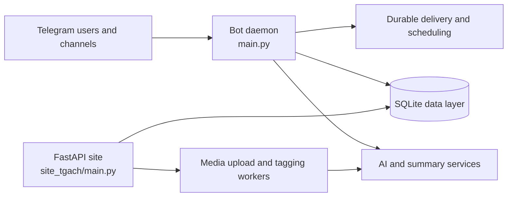

<div align="center">


# dvachbot

**A multi-board Telegram automation platform with a FastAPI community site, durable delivery flows, media processing, and AI-assisted moderation.**

[](https://www.python.org/)
[](https://docs.aiogram.dev/)
[](https://fastapi.tiangolo.com/)
[](https://sqlite.org/)

[Architecture](#architecture) · [Components](#components) · [Getting started](#getting-started) · [Configuration](#configuration) · [Verification](#verification)

</div>

---

## Overview

`dvachbot` combines a Telegram bot daemon with a FastAPI web application. The two surfaces share a SQLite-backed data model for boards, threads, posts, media, user state, and delivery records. The platform is designed around asynchronous queues, retry-aware delivery, board-specific administration, search, and media-processing workflows.

The repository contains two independently runnable services. The root application receives Telegram updates and performs bot-side work. The `site_tgach` application serves the community-facing web and API surface, including uploads and media pipelines.

## Architecture



## Components

| Area | Primary paths | Responsibility |
| --- | --- | --- |
| Bot runtime | `main.py`, `handlers/`, `admin_manager.py` | Receives Telegram updates, routes commands, and manages board-specific workflows. |
| Delivery | `delivery_manager.py`, `broadcaster.py`, `periodic_publisher.py` | Queues, retries, and schedules outbound messages without silently dropping work. |
| AI services | `ai_manager.py`, `post_processor.py` | Coordinates reply modes, summarization, and publication flows. |
| Shared services | `common/` | Holds configuration, board definitions, and the shared SQLite data access layer. |
| Web and API | `site_tgach/main.py`, `site_tgach/templates/`, `site_tgach/static/` | Serves the FastAPI application, rendered pages, browser interactions, and uploads. |
| Media pipeline | `site_tgach/importer.py`, `site_tgach/mirror_worker.py`, `site_tgach/tagging_worker.py` | Imports, mirrors, hashes, and classifies user-submitted media asynchronously. |
| Alternate import surface | `Dubsite_tgach/` | Contains a separate FastAPI-oriented import and tagging implementation. |
| Tests and diagnostics | `tests/`, `audit_*.py`, `analyze_*.py` | Covers regressions and supports targeted runtime inspection. |

## Getting started

### Prerequisites

Use Python 3.11 or later and install the repository dependencies in an isolated virtual environment. Telegram bot tokens, Telegram API credentials, and board administrator IDs are required for the bot runtime. Web deployment also needs a secret and a public base URL.

```bash
git clone https://github.com/marko1olo/dvachbot.git
cd dvachbot
python -m venv .venv
source .venv/bin/activate
pip install -r requirements.txt
```

### Configuration

Create a local `.env` file from the committed contract. Keep all production values outside Git.

```bash
cp .env.example .env
```

At minimum, configure the token for the bot surface you intend to run, its matching administrator list, and the required Telegram API credentials. The shared configuration template also documents the archive channels, FastAPI binding values, AI-provider keys, proxy settings, delivery limits, and watchdog thresholds.

```env
BOT_TOKEN=your-telegram-bot-token
ADMINS=123456789
API_ID=your-telegram-api-id
API_HASH=your-telegram-api-hash
SECRET_KEY=replace-with-a-long-random-secret
SITE_URL=https://your-public-site.example
```

Configure only the board tokens and administrator lists required by the deployment. Do not populate unrelated tokens merely to satisfy the template.

### Run the services

Start the Telegram bot from the repository root.

```bash
python main.py
```

Start the FastAPI site from its own directory so its internal Uvicorn application reference resolves to the web service rather than the root bot module.

```bash
cd site_tgach
python main.py
```

## Verification

The repository contains Python regression tests for queue behaviour, media processing, board interactions, Telegram delivery, and site workflows. Run the full project test launcher before deploying a change that affects more than one subsystem.

```bash
python run_all_tests.py
```

For a narrow change, execute the relevant test module directly and inspect its output. A successful static import is not a substitute for a live delivery or browser workflow check.

## Operational boundaries

The platform works with user-generated content and external service credentials. Keep `.env`, session files, local databases, and downloaded media outside version control. Treat provider keys and Telegram channel identifiers as deployment secrets, and use the existing asynchronous queues rather than bypassing them with direct ad hoc delivery calls.

## Repository guides

- [Architecture](ARCHITECTURE.md) describes the main runtime surfaces and their data layer.
- [Project audit and repair scope](PROJECT.md) lists the core reliability milestones.
- [Environment contract](.env.example) enumerates deploy-time settings.

---

> The project is actively evolving. When code and documentation differ, verify the executable entry point and configuration contract in the repository before changing a deployment.
