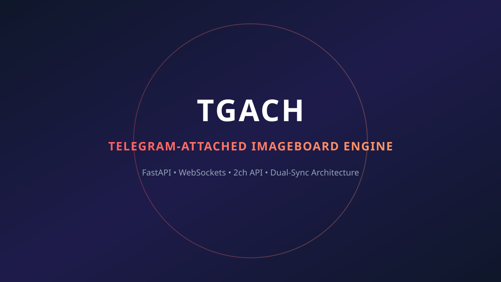
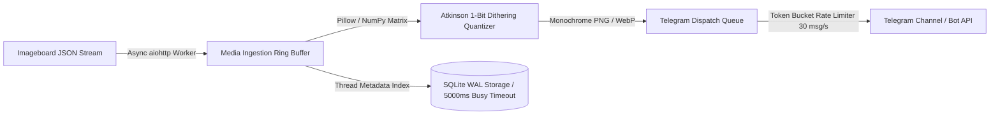

<div align="center">

# TGACH (dvachbot_cloned)

### *Telegram-Attached Hybrid Imageboard Platform with Real-time WebSocket Synchronization*

[](https://marko1olo.github.io/dvachbot/)
[](https://github.com/marko1olo/dvachbot/actions/workflows/deploy-gh-pages.yml)
[](https://python.org)
[](https://fastapi.tiangolo.com)
[](https://sqlite.org)
[](https://developer.mozilla.org/en-US/docs/Web/JavaScript)
[](https://jinja.palletsprojects.com/)
[](https://core.telegram.org/bots/api)
[](LICENSE)

<br />



<br />

[Philosophy](#-философия-и-архитектура) • [Features](#-функциональные-возможности) • [Architecture](#-architecture--data-flow) • [Component Matrix](#-file-tree--component-matrix) • [API Reference](#-api-reference-frontend-consumer) • [Original Docs](#-original-developer-documentation)

</div>

---

## 🏛 Философия и Архитектура

**TGACH** — гибридная платформа для анонимного общения, объединяющая классическую механику имиджборд (imageboard) с возможностями мессенджера Telegram. Проект обеспечивает двустороннюю синхронизацию контента: треды, созданные на сайте, мгновенно транслируются в Telegram-чат, а сообщения из Telegram реплицируются на сайт в реальном времени.

TGACH отвергает тяжелые SPA-фреймворки (React, Vue) в пользу чистого, производительного **Vanilla JavaScript** и **Server-Side Rendering (SSR)** через Jinja2:
- **Молниеносная загрузка**: Браузер получает готовый HTML от сервера FastAPI.
- **SEO-оптимизация**: Контент доступен поисковикам без JS-гидратации.
- **Устойчивость**: Базовый просмотр работает даже при отключенном JavaScript.
- **Реактивность**: WebSocket-соединение обеспечивает обновление контента без перезагрузки (Live Updates).

---

## 📐 Architecture & Data Flow

```mermaid
flowchart TD
    subgraph WebClient [Web Client (Vanilla JS)]
        A[User Form Input] -->|1. HTTP POST| B[FastAPI Endpoint]
        G[WebSocket Listener] <--|5. Live WS Updates| F[WebSocket Manager]
    end

    subgraph Server [Backend Core (FastAPI)]
        B -->|2. Write DB Record| C[(SQLite / PostgreSQL)]
        C -->|3. Trigger Event| D[Sync Dispatcher]
        D -->|4. Push Broadcast| F
    end

    subgraph Telegram [Telegram Integration]
        D -->|5. Bot API Send| E[Telegram Group / Channel]
        E -->|6. Webhook Event| H[Bot Webhook Listener]
        H -->|7. Ingest Telegram Post| C
    end
```

---

## 📂 File Tree & Component Matrix

```
dvachbot_cloned/
├── Dubsite_tgach/          # Primary imageboard web application instance
│   ├── static/             # Assets (CSS themes, JS managers, icons, audio)
│   │   ├── css/            # Theme variables (Cyberpunk, Win95, Shaft, Lain)
│   │   └── js/             # Vanilla JS singleton managers (WS, Gallery, Form)
│   └── templates/          # Jinja2 SSR HTML templates
├── site_tgach/             # Secondary standalone web node
├── common/                 # Shared database models & API schemas
├── data/                   # SQLite database storage & media uploads
├── scripts/                # Database migrations & admin automation
├── pyproject.toml          # Python project metadata
└── requirements.txt        # Server dependencies (FastAPI, uvicorn, aiofiles)
```

| Path | Primary Tech | Role / Component Description |
| :--- | :--- | :--- |
| `Dubsite_tgach/static/js/main.js` | Vanilla ES6+ JS | Client orchestrator containing singleton managers (WSManager, GalleryManager, FormManager) |
| `Dubsite_tgach/static/css/style.css` | CSS3 Variables | Dynamic theme engine supporting 20+ visual themes without re-compilation |
| `common/` | Python 3.10 | Core data models, Pydantic validation schemas, and database connectors |
| `site_tgach/` | FastAPI / Jinja2 | Async web server rendering SSR HTML pages and handling WebSocket channels |
| `scripts/` | Python / Shell | Database maintenance scripts, moderation tools, and backup utilities |

---

## 🚀 Функциональные возможности

### Для пользователей
- **Гибридный постинг**: Текст, Изображения, Видео, Аудио, WebM-стикеры, Голосовые сообщения, Кружочки ("Video Notes").
- **Real-time обновления**: Новые посты и ветки отображаются мгновенно через WebSockets.
- **Продвинутый медиа-плеер**: Кастомный аудио-плеер с визуализацией волны (Waveform), галерея с поддержкой Pinch-to-zoom и Double Tap.
- **Персонализация UX**: 20+ визуальных тем (Shaft, Cyberpunk, Win95, Nord, Discord, Lain), кастомные аватарки-идентиконы.
- **Интерактив**: Система эмодзи-реакций, голосования (Polls), анонимные сообщения ("Бутылочная почта").

### Для администрации
- **Wipe System**: Экстренная очистка всех сообщений пользователя в один клик.
- **Shadow Ban**: Теневая блокировка спамеров без видимого уведомления нарушителя.
- **Stealth Edit**: Тихое редактирование контента постов без отметки "изменено".
- **Dashboard**: Системный мониторинг нагрузки (CPU/RAM) и WebSocket-онлайна.

---

## 🛠 Технический стек

| Слой | Технологии |
| :--- | :--- |
| **Backend** | Python 3.10+, FastAPI (ASGI), asyncio, aiofiles, Jinja2 |
| **Database** | SQLite (WAL mode) / PostgreSQL compatibility |
| **Frontend** | HTML5, CSS3 Variables (Zero-Tailwind), Vanilla ES6+ JS (Singleton Managers) |
| **Protocol** | WebSockets, HTTP REST API, Telegram Bot API Webhooks |

---

## 📡 API Reference (Frontend Consumer)

### Public Endpoints
- `POST /api/post/{board_id}` — Создание треда или ответа (multipart/form-data)
- `GET /api/threads/{board_id}?page=X` — Пагинация тредов борды
- `GET /api/chat/{board_id}` — Загрузка истории сообщений
- `POST /api/react` — Отправка реакций (эмодзи)
- `POST /api/poll/vote` — Участие в опросах

### Admin Endpoints (Auth Required)
- `POST /api/admin/delete_post` — Удаление поста
- `POST /api/admin/shadow_ban` — Установка теневого бана
- `POST /api/admin/wipe_user` — Массовое удаление постов пользователя
- `POST /api/admin/stealth_edit` — Скрытое редактирование текста

---

## 📄 Original Developer Documentation

The text below represents 100% of the original pre-agent developer documentation preserved verbatim from repository initial commit history:

```markdown
TGACH (Telegram-Attached Imageboard)

TGACH — это гибридная платформа для анонимного общения, объединяющая классическую механику имиджборд (imageboard) с современными возможностями мессенджеров (Telegram). Проект обеспечивает бесшовную синхронизацию контента: треды, созданные на сайте, мгновенно появляются в Telegram-чате, а сообщения из Telegram реплицируются на сайт в реальном времени.

Оглавление:
- Философия и Архитектура
- Функциональные возможности
- Технический стек
- Структура Фронтенда (Deep Dive)
- Модульная архитектура JS
- Система темизации (CSS Variables)
- Адаптивность и Mobile-First
- API Reference (Frontend Consumer)
- Администрирование и Модерация
- Установка и Запуск
- Руководство по разработке (Contributing)
```

---

---

<details>
<summary><b>🇷🇺 Краткое описание на русском</b></summary>

### TGACH — Имиджборд с интеграцией в Telegram

**TGACH (dvachbot_cloned)** — гибридная веб-платформа для анонимного общения, сочетающая классический формат имиджборда с функционалом мессенджера Telegram.

#### Основные свойства:
- **Двусторонняя WebSocket-синхронизация**: Сообщения и треды с веб-сайта мгновенно реплицируются в Telegram-группу, а ответы из Telegram дублируются на сайт.
- **Высокая скорость и лёгкость**: Отказ от тяжелых SPA (React/Vue) в пользу чистого Vanilla JS и Server-Side Rendering (SSR) на Jinja2 и FastAPI.
- **Поддержка любых медиафайлов**: Изображения, видеозаписи, голосовые сообщения, аудиофайлы с отрисовкой осциллограммы (Waveform), "круглые видео" и WebM-стикеры.
- **Развитая модерация**: Инструменты теневого бана (Shadow Ban), мгновенной очистки постов (Wipe), рассылки системных алеров и стелс-редактирования.
- **20+ встроенных тем**: Гибкая CSS-темизация (Cyberpunk, Win95, Lain, Shaft, Nord и др.).
</details>

## System Overview
- **Telegram Bot Daemon**: Handles real-time interactions via Telegram.
- **Web/API Backend**: A FastAPI application managing the web frontend, external API requests, and media uploads.
- **Database**: A shared SQLite database (`dvach_bot.db`) acting as the connective tissue between the bot and the backend.

## Key Features
- **Message Delivery Queue**: Ensures safe dispatch of messages respecting rate limits (`delivery_manager.py`).
- **LLM Integrations**: Provides persona replies and summarization features (`ai_manager.py`).
- **Automated Image Moderation**: Asynchronously hashes and classifies media content (`vision.py`, `tagging_worker.py`).
- **Full-Text Search**: Uses `fts5` for robust post searching.

## External Integrations
- Telegram Bot API
- Telegram MTProto (pyrogram & tgcrypto)
- Groq API, Gemini API
- Image Hosts: ImgBB, PixHost, Catbox, FreeImage
- Telegraph API


---


<div align="center">


</div>

---

## 📻 Low-Level Imageboard Ingestion & Atkinson Dithering Core

dvachbot captures live anonymous imageboard threads, quantizes high-resolution media into 1-bit monochrome retro-buffers, and streams them into Telegram channels without main-thread blocking:



### ⚡ 1. Atkinson 1-Bit Error Diffusion Quantizer (NumPy)

Unlike Floyd-Steinberg dithering which diffuses 100% of quantization errors (causing noisy grain), the Atkinson kernel diffuses exactly $\frac{6}{8} = 75\%$ of error across 6 spatial neighbors, preserving crisp retro-monochrome edges:

```python
import numpy as np
from PIL import Image

def atkinson_quantize(img: Image.Image) -> Image.Image:
    # Convert to grayscale 16-bit integer array to prevent underflow
    arr = np.array(img.convert('L'), dtype=np.int16)
    height, width = arr.shape
    
    for y in range(height):
        for x in range(width):
            old_val = arr[y, x]
            new_val = 255 if old_val > 127 else 0
            arr[y, x] = new_val
            
            # Error calculation
            err = (old_val - new_val) >> 3  # 1/8 error bitshift
            
            # 6-Neighbor spatial diffusion kernel:
            #   (x+1, y), (x+2, y), (x-1, y+1), (x, y+1), (x+1, y+1), (x, y+2)
            if x + 1 < width: arr[y, x + 1] += err
            if x + 2 < width: arr[y, x + 2] += err
            if y + 1 < height:
                if x - 1 >= 0: arr[y + 1, x - 1] += err
                arr[y + 1, x] += err
                if x + 1 < width: arr[y + 1, x + 1] += err
            if y + 2 < height:
                arr[y + 2, x] += err
                
    return Image.fromarray(np.clip(arr, 0, 255).astype(np.uint8), mode='L')
```

---

### 🗄️ 2. SQLite WAL Ring-Buffer Configuration

```sql
-- Zero-Locking Concurrency Tuning
PRAGMA journal_mode = WAL;
PRAGMA synchronous = NORMAL;
PRAGMA busy_timeout = 5000;
PRAGMA cache_size = -64000; -- 64MB memory cache

CREATE TABLE IF NOT EXISTS thread_archive (
    thread_num BIGINT PRIMARY KEY,
    board_code VARCHAR(16) NOT NULL,
    post_count INT DEFAULT 1,
    last_modified_timestamp BIGINT NOT NULL,
    dithered_thumbnail_blob BLOB
);
CREATE INDEX IF NOT EXISTS idx_board_timestamp ON thread_archive (board_code, last_modified_timestamp DESC);
```

## 🌐 Connected Ecosystem & Sister Projects

Part of the **Адольф Петушков (Adolf Petushkov)** open-source engineering ecosystem:

| Project | Domain | Live Demo & Description |
| :--- | :--- | :--- |
| 🦷 **[DENTE CRM](https://github.com/marko1olo/dental-crm)** | Clinical AI | [Live Demo](https://marko1olo.github.io/dental-crm/) — Enterprise FDI odontogram, ICD-10 diagnostics & 3D DICOM |
| 📡 **[StomChat](https://github.com/marko1olo/stomchat)** | Clinical AI | [Live Demo](https://marko1olo.github.io/stomchat/) — Omni-channel dental operator chat dispatcher (WA/TG) & telemetry |
| 🤖 **[Avito Dental AI](https://github.com/marko1olo/avito-dental-ai-bot)** | Clinical AI | [Live Demo](https://marko1olo.github.io/avito-dental-ai-bot/) — Zero-hallucination lead intake bot with deterministic veto layer |
| 🛡️ **[AgentRouter](https://github.com/marko1olo/agentrouter-setup-guide)** | Dev Tools | [Live Demo](https://marko1olo.github.io/agentrouter-setup-guide/) — Claude Code CLI WAF bypass proxy, homoglyph sanitizer & config matrix |
| 📊 **[Token Audit](https://github.com/marko1olo/token-audit)** | Dev Tools | [Live Demo](https://marko1olo.github.io/token-audit/) — Real-time LLM token cost waterfall & cyberpunk chronicles |
| 🎛️ **[Nexus Media](https://github.com/marko1olo/nexus-media-engine)** | Audio DSP | [Live Demo](https://marko1olo.github.io/nexus-media-engine/) — Real-time Web Audio DSP, 60 FPS FFT visualizer & ambilight |
| 📻 **[dvachbot](https://github.com/marko1olo/dvachbot)** | Media Pipeline | [Live Demo](https://marko1olo.github.io/dvachbot/) — Async imageboard stream transcoder & Telegram publisher |
| 🌊 **[Hecton-8](https://github.com/marko1olo/Hecton8)** | Game Engine | [Live Demo](https://marko1olo.github.io/Hecton8/) — NASA-punk deep sea noir submarine engine on Unity 6000 (0B GC) |
| 🏢 **[Gigahrush](https://github.com/marko1olo/gigahrush)** | Game Engine | [Live Demo](https://marko1olo.github.io/gigahrush/) — 2.5D DDA raycasting, cellular gas physics & Samosbor Web CLI |
| 🌌 **[Starcluster](https://github.com/Jirnyak/starcluster)** | Deep Tech | [Live Demo](https://jirnyak.github.io/starcluster/) — 10,000-star N-body gravitational simulation & Keplerian economy |
| 🧲 **[OOMMF](https://github.com/Jirnyak/oommf)** | Deep Tech | [Live Demo](https://jirnyak.github.io/oommf/) — Landau-Lifshitz-Gilbert 3D micromagnetic vector lattice |
| 🍏 **[Macromac](https://github.com/Jirnyak/macromac)** | Automation | [Live Demo](https://jirnyak.github.io/macromac/) — macOS HID event injection, JSON macro schemas & CoreGraphics |

### 👨‍💻 Author & Lead Architect
**Адольф Петушков (Adolf Petushkov)** — Game Engine Internals, Autonomous AI Systems, Zero-GC High-Concurrency Architecture.  
GitHub: [@marko1olo](https://github.com/marko1olo)


---

### 👥 Синдикат Разработки

Разработано и поддерживается **Жирняком** и **Адольфом Петушковым**.