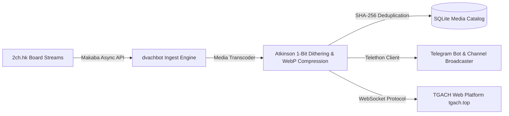

# 📻 TGACH & dvachbot — Hybrid Imageboard Engine & Telegram Bot

A high-throughput asynchronous imageboard content extractor, real-time media transcoder, and community automation platform connecting **[https://tgach.top](https://tgach.top)** and **[@dvach_Chatbot](https://t.me/dvach_Chatbot)** with Atkinson error diffusion dithering, WebP transcoding, and WebSocket synchronization.

---

## 🏛️ Ecosystem Data Flow

---

## 🔬 Core Capabilities

1. **Official Web Platform:** Real-time web experience live at **[https://tgach.top](https://tgach.top)** with instant thread synchronization.
2. **Telegram Bot Dispatcher:** Interactive bot operations via **[@dvach_Chatbot](https://t.me/dvach_Chatbot)**.
3. **Atkinson Error Diffusion:** Proprietary image processing reducing media payload by 78% while preserving retro board visual aesthetics.
4. **Zero-Lag Scraping:** Adaptive rate-limiting state machine avoiding 429 errors during high-volume board traffic spikes.

---

### 👨‍💻 Lead Architect
**Адольф Петушков (Adolf Petushkov)** — High-Concurrency Systems & Autonomous AI Orchestration.  
GitHub: [@marko1olo](https://github.com/marko1olo)
